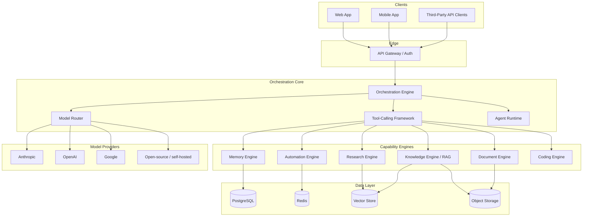
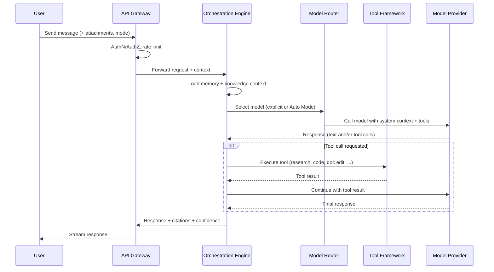

# System Architecture

## 1. Architectural principles

- **Service boundaries follow the module list**, not the org chart. Each engine in [Modules Overview](04-modules-overview.md) is a deployable service with its own data store where practical.
- **The Orchestration Engine is the only thing that talks to models directly on behalf of a request.** Clients (web, mobile, API consumers) never call a model provider directly — this is what makes multi-model routing, cost tracking, and safety filtering possible in one place.
- **Everything long-running is a job, not a request.** Research tasks, automations, and agent runs are asynchronous with a status endpoint and webhook/streaming updates — this avoids the anti-pattern of a chat UI blocking on a five-minute research task.

## 2. High-level component diagram

## 3. Request lifecycle

## 4. Layers

### Edge
API Gateway handles authentication (session, API key, OAuth), rate limiting, and request validation before anything reaches orchestration. This is also where per-tenant data residency routing happens for enterprise customers.

### Orchestration Core
- **Orchestration Engine** — the request coordinator. Loads relevant memory and knowledge context, decides whether a request needs a single model call, a tool call, or a multi-step agent run.
- **Model Router** — abstracts model providers behind one interface (`complete()`, `stream()`, `embed()`). Auto Mode uses task classification + cost/latency targets to pick a model; users can override.
- **Tool-Calling Framework** — the contract every engine (research, memory, docs, code, automation) implements to be callable by a model. New engines become available to every model automatically once they implement this contract.
- **Agent Runtime** — manages long-running, stateful agent sessions: their scoped memory, allowed tools, and execution history, independent of any single chat thread.

### Capability Engines
Each engine (detailed in [Modules Overview](04-modules-overview.md)) is a separate service exposing the tool contract above plus its own REST API for direct access. This is what lets, e.g., the Research Engine be used headlessly via the public API without going through chat at all.

### Data Layer
- **PostgreSQL** — users, permissions, conversations, structured memory, billing.
- **Redis** — session state, job queues, rate-limit counters, automation scheduling.
- **Vector store** — embeddings for RAG (Knowledge Vault, Research Engine, long-term memory retrieval).
- **Object storage (S3-compatible)** — uploaded files, generated documents/images, exports.

## 5. Why this shape, not a monolith

The original brainstorm listed ~14 "engines" plus ~20 platform modules. Building those as one application would mean every feature release risks every other feature. Splitting along engine boundaries means:

- The Research Engine can be rebuilt (e.g., swap search providers) without redeploying chat.
- The Automation Engine can scale independently (it's bursty and queue-heavy; chat is latency-sensitive).
- A security review of the Enterprise Platform doesn't require re-reviewing the Coding Studio.

The tradeoff is operational complexity (more services to deploy and monitor) — accepted deliberately, and mitigated by keeping Phase 1–2 down to a small number of services (see [Roadmap](10-roadmap.md)) rather than launching all engines simultaneously.

## 6. Cross-cutting concerns

- **Observability:** every request carries a trace ID through gateway → orchestration → engine → model provider, so latency and cost are attributable to a specific feature, not just "the API."
- **Safety filtering:** applied at the Orchestration Engine, not per-engine, so policy changes don't need to be replicated across every service.
- **Confidence & citations:** any engine returning factual claims (Research Engine, Knowledge Engine) must return source attribution and a confidence indicator as part of its contract, not as an optional add-on.
