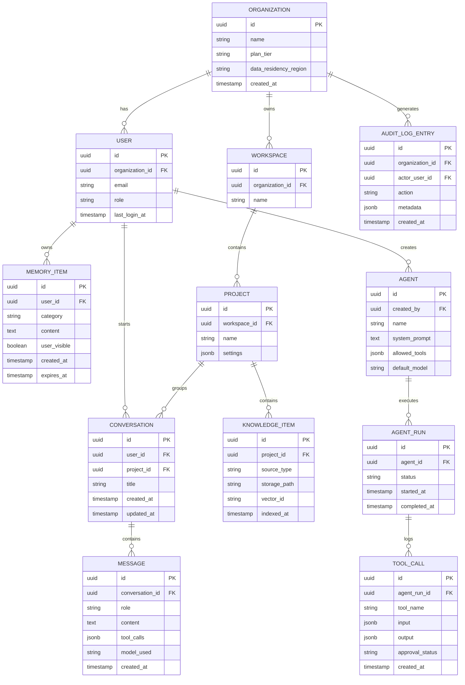

# Database Design

## 1. Storage strategy by data type

| Data type | Store | Rationale |
|---|---|---|
| Users, orgs, permissions, billing | PostgreSQL | Strong consistency, relational integrity for RBAC |
| Conversations & messages | PostgreSQL (partitioned by org/time) | Structured, queryable, needs transactional writes |
| Structured memory (preferences, project facts) | PostgreSQL | Needs to be user-editable via a normal CRUD UI |
| Embeddings (RAG, semantic search) | Vector store (e.g., pgvector or a dedicated vector DB) | Similarity search at scale |
| Session state, job queues, rate limits | Redis | Low-latency, ephemeral by design |
| Uploaded files, generated documents/images | Object storage (S3-compatible) | Large binary blobs, cheap at scale |
| Audit logs | Append-only PostgreSQL table (or log pipeline for enterprise scale) | Immutability and queryability both matter for compliance |

## 2. Core schema (initial)

## 3. Design notes

- **`MEMORY_ITEM.user_visible`** exists because not every internally-tracked signal should be surfaced as "the AI remembers this" — but anything used to personalize a response must be visible on request. Default to visible; hiding requires justification.
- **`TOOL_CALL.approval_status`** (`auto_approved` / `pending` / `approved` / `denied`) implements the risk-tiered execution model from [Security & Compliance](07-security-and-compliance.md) at the data layer, not just in application logic — this makes audit queries ("show me every action taken without explicit approval") a simple query rather than a log-mining exercise.
- **Partitioning:** `MESSAGE` and `AUDIT_LOG_ENTRY` are the two tables expected to grow fastest; both should be partitioned by organization and time from the start rather than retrofitted.
- **Vector store is referenced, not embedded**, via `vector_id` — keeps the relational schema stable even if the vector database is swapped later (see the architecture rationale in [System Architecture §5](03-system-architecture.md#5-why-this-shape-not-a-monolith)).

## 4. Indexing priorities (v1)

- `MESSAGE(conversation_id, created_at)` — conversation loading is the hottest read path
- `MEMORY_ITEM(user_id, category)` — memory lookups happen on every orchestration request
- `AUDIT_LOG_ENTRY(organization_id, created_at)` — compliance queries filter by org and date range
- `AGENT_RUN(agent_id, status)` — automation dashboards poll for in-progress runs

## 5. What's deferred

Full multi-region replication topology, read-replica strategy, and backup/restore SLAs are Phase 4 (Enterprise) concerns and are scoped in detail once data residency requirements are contractually known, rather than speculated on here.
